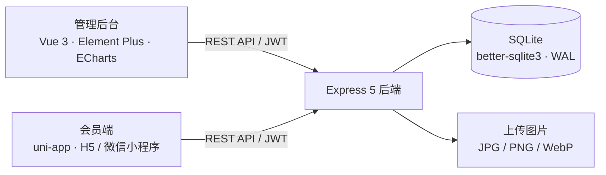

# 乐享健身预约管理平台

**Vue 3 管理后台 + uni-app 会员端 + Express / SQLite 后端的健身课程预约项目。**

围绕场馆日常运营，串联课程发布、教练排班、会员预约、取消预约、签到与经营统计。管理员和员工使用 Web 后台，会员通过 H5 或微信小程序浏览课程、选择时段和管理预约；两端共用一套接口与数据库。

项目以本地演示、源码学习和作品集展示为主，随附种子数据、原创运动插画、接口回归脚本和 58 章离线学习指南。

## 功能概览

| 模块 | 已实现功能 |
| --- | --- |
| 登录与权限 | 后台账号密码登录、会员模拟验证码登录、JWT 鉴权、管理员 / 员工 / 会员权限划分、登录态持久化及过期处理 |
| 工作台 | 今日预约、今日课程、上座率、本月营收、近 7 日预约趋势、热门课程、本月每日营收 |
| 会员管理 | 分页查询、手机号 / 昵称搜索、新增编辑、启用停用 |
| 课程管理 | 分类维护、课程筛选、价格与时长设置、上下架、封面上传、有排班时的删除保护 |
| 教练与排班 | 教练资料、头像上传、每周 7 天 × 6 时段排班、容量设置、冲突检查、未保存离开提示 |
| 预约管理 | 按日期 / 课程 / 状态 / 会员筛选、预约状态展示、后台取消、会员查看与取消 |
| 预约规则 | 提前预约天数、每人每日预约上限；会员端按后台规则生成可预约日期 |
| 经营统计 | 按日 / 月统计、日期范围筛选、营收 / 订单数 / 客单价汇总、课程热度排行 |
| 会员端 | 分类与搜索、热门课程、课程 / 教练详情、剩余名额、预约确认、我的预约、每日签到与签到记录 |

### 角色权限

| 能力 | 管理员 | 员工 | 会员 |
| --- | :---: | :---: | :---: |
| 工作台看板（包含本月营收） | ✓ | ✓ | — |
| 会员 / 课程 / 教练 / 预约管理 | ✓ | ✓ | — |
| 预约规则、独立营收统计与课程热度接口 | ✓ | — | — |
| 个人预约、取消与签到 | — | — | ✓ |
| 公开课程、教练、可约时段 | ✓ | ✓ | ✓ |

后台菜单与路由守卫控制可见范围，后端同时校验角色权限。

## 核心实现

- **预约事务**：使用 SQLite `IMMEDIATE` 事务获取写锁，在同一事务内检查会员、课程、教练和排班状态，校验日期、重复预约、每日上限及剩余名额，再写入预约。
- **规则贯通**：公开规则接口驱动会员端日期范围；后端再次校验预约范围，并过滤当天已经开始的时段。
- **取消与名额**：会员仅可取消本人距开课超过 2 小时的有效预约；取消后，该时段名额重新可用。
- **组件复用**：后台抽取 `ProTable`、`ProForm`、`Chart`，统一表格、表单与图表交互；Element Plus 与 ECharts 按需引入。
- **跨端适配**：会员端使用同一套 Vue 页面构建 H5 与微信小程序，包含小程序样式、图片格式和导航适配。
- **演示资源独立保存**：17 组原创插画提供 SVG 源稿与 PNG；初始化时复制到上传目录，克隆项目后无需额外找图片。

## 技术架构



| 子项目 | 技术 |
| --- | --- |
| `admin-web` | Vue 3、Vite 8、Vue Router、Pinia、pinia-plugin-persistedstate、Element Plus、ECharts、Axios |
| `miniapp` | uni-app（Vue 3）、Vite 5、Pinia、SCSS |
| `server` | Express 5、better-sqlite3、jsonwebtoken、bcryptjs、multer、CORS |

数据库包含 `admin`、`member`、`category`、`course`、`coach`、`schedule`、`booking`、`signin`、`rules` 共 9 张表。接口统一返回 `{ code, data, message }`，其中 `code: 0` 表示成功。

## 快速开始

### 1. 环境与安装

推荐 **Node.js 24 LTS + npm**。本仓库提交了三个子项目的 `package-lock.json`，使用 `npm ci` 安装锁定依赖。数据库为本地 SQLite，无需安装 MySQL、Redis 或额外数据库服务。

```bash
git clone https://github.com/Rainronin/lexiang-fitness-booking.git
cd lexiang-fitness-booking

cd server
npm ci --ignore-scripts
cd ../admin-web
npm ci
cd ../miniapp
npm ci
cd ..
```

后端锁定的 `better-sqlite3` 13 包内带有原生模块，使用 `npm ci --ignore-scripts` 可避免 npm 额外触发本地 C++ 编译；本项目后端依赖不需要安装脚本，已在 Windows x64 / Node.js 24 上验证安装与数据库加载。其他系统如遇原生模块不兼容，需配置对应编译工具链后重新构建。

### 2. 初始化并启动后端

首次运行，在仓库根目录打开终端：

```bash
cd server
npm run seed
npm run dev
```

**`npm run seed` 会重建数据库，并清空、重建 `server/uploads/`。仅在首次运行或明确需要重置演示数据时执行；已有数据请先备份。** 日常启动直接运行 `npm run dev` 或 `npm start`。

初始化会生成后台账号、4 个课程分类、12 门课程、5 位教练、每周排班，以及相对当前日期生成的演示会员、预约和签到数据。

### 3. 启动管理后台

另开一个终端，在仓库根目录执行：

```bash
cd admin-web
npm run dev
```

访问 [http://localhost:4180](http://localhost:4180)。开发服务器会将 `/api` 与 `/uploads` 转发到后端 `3000` 端口。

### 4. 启动会员 H5

再开一个终端，在仓库根目录执行：

```bash
cd miniapp
npm run dev:h5
```

访问 [http://localhost:4174](http://localhost:4174)，可使用浏览器的手机视图体验。

| 服务 | 默认地址 |
| --- | --- |
| 后端健康检查 | [http://localhost:3000/api/health](http://localhost:3000/api/health) |
| 管理后台 | [http://localhost:4180](http://localhost:4180) |
| 会员 H5 | [http://localhost:4174](http://localhost:4174) |

前端端口启用了 `strictPort`；若端口被占用，需释放端口或调整对应的 `vite.config.js`。

## 演示账号与体验路线

| 身份 | 账号 | 密码 / 验证码 |
| --- | --- | --- |
| 管理员 | `admin` | `123456` |
| 员工 | `staff` | `123456` |
| 会员 | 任意符合格式的 11 位手机号 | 固定验证码 `123456` |

会员首次登录会自动创建账号，手机号建议使用演示数据，不填写真实个人信息。

推荐先用管理员查看工作台，在「教练管理 → 排班设置」查看课程与容量；随后在会员端登录，选择课程和未来时段并提交预约；回到后台按会员手机号筛选，即可看到同一条预约。最后可验证取消后名额恢复、员工菜单权限和每日签到。

## 微信小程序运行

1. 在 `miniapp/src/manifest.json` 的 `mp-weixin.appid` 填写自己的测试号或真实 AppID。
2. 在 `miniapp` 目录执行：

   ```bash
   npm run build:mp-weixin
   ```

3. 用微信开发者工具导入 **`miniapp/dist/build/mp-weixin`**，并选择对应 AppID。也可自行在 `miniapp/project.config.json` 配置 `miniprogramRoot: "dist/build/mp-weixin/"` 后导入 `miniapp`。
4. 本地模拟器访问 `localhost` 时，需在开发者工具的本地设置中关闭合法域名校验。游客模式曾干扰本项目的登录请求，请使用测试号或真实 AppID。

个人 AppID、工具偏好和本地路径不随仓库发布；`project.config.json`、`project.private.config.json` 已忽略，首次导入时由工具创建或自行配置。

### 真机与接口地址

`miniapp/src/config.js` 默认连接 `http://localhost:3000`。手机中的 `localhost` 指向手机自身；局域网调试时，可复制 `miniapp/.env.example` 为 `miniapp/.env.local`，将以下地址改为开发电脑的局域网 IP，再重新启动或构建：

```dotenv
VITE_API_BASE=http://192.168.1.100:3000/api
VITE_UPLOAD_BASE=http://192.168.1.100:3000
```

注意图片路径为 `/uploads`，不包含 `/api`。正式小程序还需配置 HTTPS 服务和微信合法域名。

## 构建与验证

在仓库根目录分别执行：

```bash
# 管理后台：输出 admin-web/dist
cd admin-web
npm run build

# 并发 401 与登录导航回归（使用 Node.js 24）
node scripts/check-401.js

# 会员端：输出 miniapp/dist/build/h5 与 miniapp/dist/build/mp-weixin
cd ../miniapp
npm run build:h5
npm run build:mp-weixin

# 后端冒烟：需先在另一终端启动同一份 server
cd ../server
node scripts/smoke-test.js
```

后端脚本覆盖鉴权与角色权限、分类 / 课程 / 教练 / 会员维护、图片上传、预约名额与重复校验、取消、规则、统计、签到和预约列表筛选。**脚本会创建测试数据并临时调整排班容量和规则，应在独立的演示副本运行，不要直接对有保留价值的数据库执行。**

构建成功只代表产物生成通过；微信开发者工具与实体手机的运行验收仍需在相应环境中进行。

2026-10-08 发布前检查：三端依赖按上述命令安装通过，后端冒烟 **66 / 66**、后台并发 401 回归、后台 / H5 / 微信小程序构建均通过。详见 [发布检查记录](docs/发布检查-20261008.md)。

## 目录结构

```text
lexiang-fitness-booking/
├── admin-web/
│   ├── scripts/check-401.js      # 登录过期处理回归
│   └── src/
│       ├── api/                  # Axios 与业务接口
│       ├── components/           # ProTable / ProForm / Chart
│       ├── layout/               # 后台布局与菜单
│       ├── router/               # 路由与角色守卫
│       └── views/                # 业务页面
├── miniapp/
│   ├── .env.example              # 可选接口地址示例
│   └── src/
│       ├── pages/                # 首页、详情、预约、个人中心等
│       ├── static/               # TabBar 图标
│       ├── stores/               # 会员登录态
│       └── utils/                # 请求、日期与图片地址
├── server/
│   ├── assets/demo-art/          # 原创插画 SVG / PNG
│   ├── scripts/                  # 冒烟测试与图片刷新
│   └── src/
│       ├── db/                   # 建表、初始化与种子数据
│       ├── middleware/           # 鉴权及错误处理
│       ├── routes/               # 按业务模块组织的 REST API
│       └── utils/                # JWT、日期、响应与时段字典
└── docs/                         # 功能清单、架构、设计、审查与学习指南
```

`server/data.db`、SQLite WAL 文件、`server/uploads/`、依赖目录、构建目录、本地环境文件和核验截图均不提交。演示插画与 TabBar 图标属于运行所需源资源，会随代码保留。

## 文档与学习

- [功能清单](docs/健身预约平台功能清单.md)：两端功能与验收项。
- [项目计划与 API 清单](docs/健身预约平台项目计划.md)：数据模型、接口和业务规则。
- [架构图源文件](docs/乐享健身预约平台-架构图.json)：配套 [交互架构图](docs/乐享健身预约平台-架构图.html)，下载后在浏览器打开。
- [UI 重构设计方案](docs/乐享健身UI重构设计方案.md)：视觉规范、组件状态与响应式设计。
- [代码审查记录](docs/代码审查记录表.md) 与 [修复记录](docs/修复记录.md)：已处理问题与历史验证记录。
- [58 章源码学习指南](docs/学习指南/index.html)：下载仓库后双击打开，支持目录、搜索、学习进度、主题切换和代码复制。
- [演示图片说明](server/assets/demo-art/README.md)：插画资源与已有库的安全更新方式。

历史文档中的测试数量和状态对应当时版本；当前行为以代码和实际验证结果为准。

## 当前范围

- 短信发送为模拟实现，验证码固定为 `123456`；没有接入真实短信、微信授权登录或支付。
- 营收按有效预约关联的课程价格聚合，用于经营看板演示，不是支付流水或财务结算。
- JWT 默认使用源码中的开发密钥；后端支持通过系统环境变量 `JWT_SECRET` 覆盖。Node 启动脚本不会自动加载 `.env`。
- 数据与上传文件保存在本机，未提供云端托管、自动备份或生产部署方案。
- 已实现并维护的会员目标端为 H5 与微信小程序；脚手架包含的其他平台命令不代表这些平台经过验收。

仓库公开提供源码与说明，便于学习和展示；公开源码本身不会自动部署网站或上线微信小程序。
